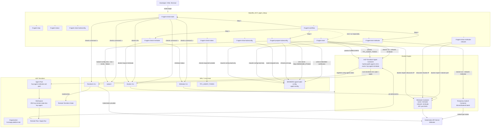

```mermaid
flowchart TB
    Developer["Developer / WSL Terminal"]

    subgraph Makefile["Makefile_HCP_Agent_Setup"]
        CheckTools["tf-agent-check-tools"]
        CheckToken["tf-agent-check-token"]
        CheckMinikube["tf-agent-check-minikube"]
        ShowNetwork["tf-agent-show-minikube-network"]
        PrepareKubeconfig["tf-agent-prepare-kubeconfig"]
        ShowKubeconfig["tf-agent-show-kubeconfig"]
        TestMinikube["tf-agent-test-minikube"]
        StartAgent["tf-agent-start"]
        StopAgent["tf-agent-stop"]
        StatusAgent["tf-agent-status"]
        CleanKubeconfig["tf-agent-clean-kubeconfig"]
        GuidedWorkflow["tf-agent-workflow"]
    end

    subgraph Host["WSL / Linux Host"]
        TerraformCLI["Terraform CLI"]
        Kubectl["kubectl"]
        MinikubeCLI["Minikube CLI"]
        DockerCLI["Docker CLI"]
        Token["TFC_AGENT_TOKEN"]
        KubeDir["$HOME/tfc-agent-kube/\nconfig\nagent-config"]
    end

    subgraph Docker["Docker Engine"]
        Minikube["Minikube Container\nname: minikube\nnetwork: minikube\nAPI: port 8443"]
        KubectlContainer["Temporary kubectl Container\nbitnami/kubectl:latest"]
        AgentContainer["HCP Terraform Agent Container\nhashicorp/tfc-agent:1.30.1\nname: hcp-agent-minikube"]
    end

    subgraph HCP["HCP Terraform"]
        Organization["Organization\nhcrmapp-platform-lab"]
        Workspace["Workspace\ntf02-hcp-remote-state-dev-hcp-agent"]
        AgentPool["Agent Pool\nhcp-agent-minikube-wsl-pool"]
        RemoteState["Remote Terraform State"]
        RemoteRun["Remote Plan / Apply Run"]
    end

    KubernetesAPI["Kubernetes API Server\nMinikube"]

    Developer -->|"make target"| Makefile

    Makefile --> CheckTools
    Makefile --> CheckToken
    Makefile --> CheckMinikube
    Makefile --> ShowNetwork
    Makefile --> PrepareKubeconfig
    Makefile --> ShowKubeconfig
    Makefile --> TestMinikube
    Makefile --> StartAgent
    Makefile --> StopAgent
    Makefile --> StatusAgent
    Makefile --> CleanKubeconfig
    Makefile --> GuidedWorkflow

    CheckTools -->|"checks command -v"| DockerCLI
    CheckTools -->|"checks command -v"| Kubectl
    CheckTools -->|"checks command -v"| MinikubeCLI
    CheckTools -->|"checks command -v"| TerraformCLI
    CheckTools -->|"docker info"| DockerCLI

    CheckToken -->|"checks exported variable"| Token

    CheckMinikube -->|"minikube status"| MinikubeCLI
    CheckMinikube -->|"docker inspect minikube"| DockerCLI
    MinikubeCLI --> Minikube
    DockerCLI --> Docker

    ShowNetwork -->|"docker inspect / docker port"| Minikube
    ShowNetwork -->|"discovers Docker IP"| Minikube

    PrepareKubeconfig -->|"kubectl config view --raw --minify --flatten"| Kubectl
    PrepareKubeconfig -->|"docker inspect discovers IP"| Minikube
    PrepareKubeconfig -->|"writes embedded certificates"| KubeDir
    PrepareKubeconfig -->|"sets server https://MINIKUBE_IP:8443"| KubeDir
    PrepareKubeconfig -->|"chmod and copy"| KubeDir

    ShowKubeconfig -->|"reads endpoint only"| KubeDir

    TestMinikube -->|"mounts config read-only"| KubeDir
    TestMinikube -->|"docker run --network minikube"| KubectlContainer
    KubectlContainer -->|"kubectl get nodes"| KubernetesAPI
    Minikube --> KubernetesAPI

    StartAgent -->|"mounts config read-only"| KubeDir
    StartAgent -->|"docker run --network minikube"| AgentContainer
    StartAgent -->|"passes TFC_AGENT_TOKEN"| AgentContainer
    StartAgent -->|"passes KUBECONFIG"| AgentContainer

    AgentContainer -->|"registers using agent token"| AgentPool
    AgentPool --> Workspace
    Workspace --> RemoteRun
    RemoteRun -->|"job delivered to"| AgentContainer

    AgentContainer -->|"runs terraform init / plan / apply"| TerraformCLI
    TerraformCLI -->|"Kubernetes provider"| KubernetesAPI
    TerraformCLI -->|"reads/writes"| RemoteState

    GuidedWorkflow -->|"Step 1"| CheckTools
    GuidedWorkflow -->|"Step 2"| CheckMinikube
    GuidedWorkflow -->|"Step 3"| PrepareKubeconfig
    GuidedWorkflow -->|"Step 4"| TestMinikube
    GuidedWorkflow -.->|"next: run separately"| StartAgent

```

