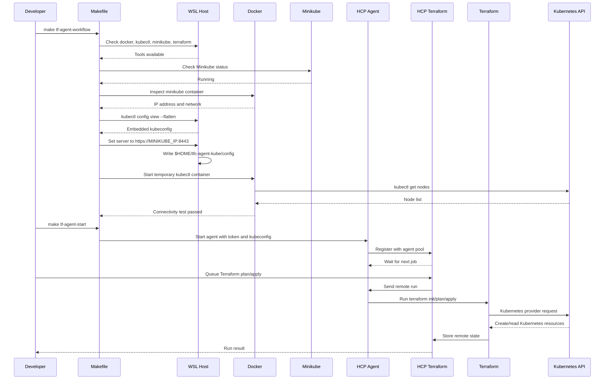

```mermaid
sequenceDiagram
    participant User as Developer
    participant Make as Makefile
    participant Host as WSL Host
    participant Docker as Docker
    participant Mini as Minikube
    participant Agent as HCP Agent
    participant HCP as HCP Terraform
    participant TF as Terraform
    participant K8s as Kubernetes API

    User->>Make: make tf-agent-workflow

    Make->>Host: Check docker, kubectl, minikube, terraform
    Host-->>Make: Tools available

    Make->>Mini: Check Minikube status
    Mini-->>Make: Running

    Make->>Docker: Inspect minikube container
    Docker-->>Make: IP address and network

    Make->>Host: kubectl config view --flatten
    Host-->>Make: Embedded kubeconfig

    Make->>Host: Set server to https://MINIKUBE_IP:8443
    Host->>Host: Write $HOME/tfc-agent-kube/config

    Make->>Docker: Start temporary kubectl container
    Docker->>K8s: kubectl get nodes
    K8s-->>Docker: Node list
    Docker-->>Make: Connectivity test passed

    User->>Make: make tf-agent-start
    Make->>Agent: Start agent with token and kubeconfig
    Agent->>HCP: Register with agent pool
    HCP-->>Agent: Wait for next job

    User->>HCP: Queue Terraform plan/apply
    HCP->>Agent: Send remote run
    Agent->>TF: Run terraform init/plan/apply
    TF->>K8s: Kubernetes provider request
    K8s-->>TF: Create/read Kubernetes resources
    TF->>HCP: Store remote state
    HCP-->>User: Run result

```